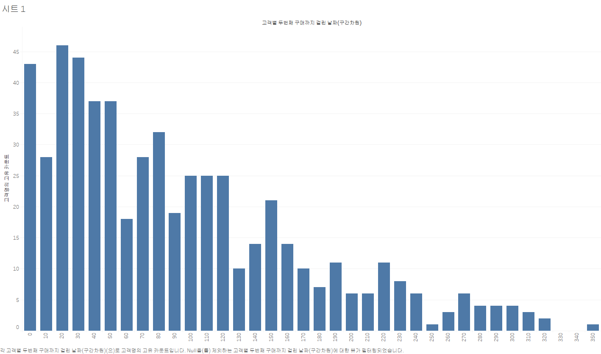
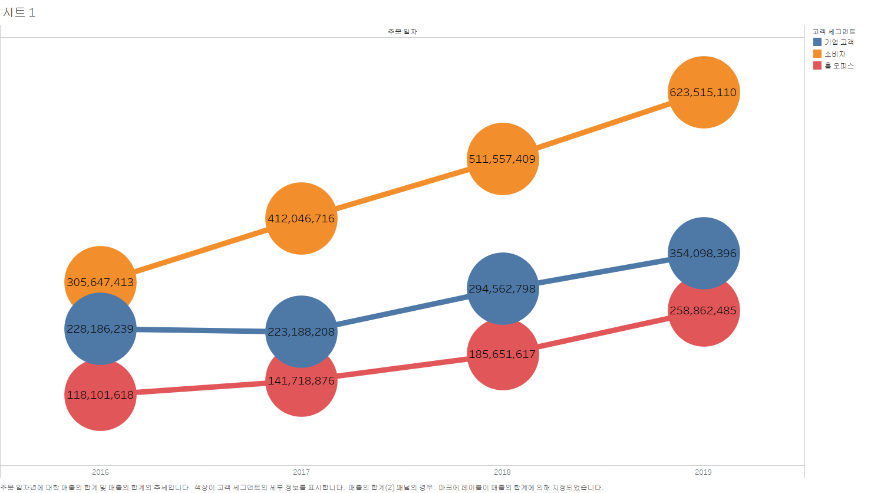

# tableau

## 1. 고객별 재구매 시기 데이터 분석 시각화
- 히스토그램 그래프
- 
- 설명 : 이 그래프는 고객의 첫 구매 이후 두 번째 구매까지 걸린 일수를 일별로 나눈 분포를 보여줍니다.
X축은 고객이 두 번째 구매를 하기까지 소요된 일수를 나타내며, Y축은 해당 일수에 해당하는 고객의 수를 나타냅니다.
각 막대는 특정 구간에 해당하는 고객 수를 보여주며, 높이가 높을수록 그 구간에 해당하는 고객의 재구매 비율이 높은 것을 의미합니다. 
그래프를 보면, 두 번째 구매까지 걸린 일수가 10일에서 50일 사이에 많은 고객이 집중되어 있으며, 특히 20일, 30일, 40일 구간에서 높은 빈도를 보입니다.
이는 많은 고객들이 첫 구매 후 약 한 달 이내에 두 번째 구매를 하는 경향이 있음을 시사합니다. 반면 100일 이후부터는 두 번째 구매를 하는 고객 수가 급격히 줄어들며, 이후에는 일정한 패턴 없이 낮은 빈도가 이어집니다.
예를 들어, 그래프에서 100일 구간에 해당하는 막대는 고객들이 두 번째 구매까지 걸린 평균 기간이 100일임을 나타내며, 교차 카운트는 25명입니다.

## 2. 고객 세그먼트별 매출액 증감 추이 데이터 분석 시각화
- 원+라인 그래프
- 
- 설명 : 이 그래프는 연도별로 세 가지 고객 세그먼트(기업 고객, 소비자, 홈 오피스)의 매출 추이를 보여줍니다.
X축은 연도를, Y축은 매출 금액을 나타내며, 각 세그먼트는 서로 다른 색상과 원형 마커로 표시되어 있습니다.
그래프에 따르면, 기업 고객 세그먼트(주황색)는 지속적으로 매출이 증가하고 있으며, 특히 2019년에 6억 2천만 이상의 매출을 기록하여 세그먼트 중 가장 높은 매출을 보였습니다.
소비자 세그먼트(파란색)는 비교적 완만하게 증가하는 추세를 보이고 있지만, 2016년부터 2019년까지 꾸준한 성장세를 유지하고 있습니다.
홈 오피스 세그먼트(빨간색)는 다른 두 세그먼트에 비해 매출이 낮지만, 2016년부터 2019년까지 매출이 증가하여 2억 5천만에 이르는 매출을 기록했습니다.
이를 통해 각 고객 세그먼트의 매출 성장 패턴을 파악할 수 있으며, 기업 고객 세그먼트가 가장 큰 성장 잠재력을 가지고 있음을 알 수 있습니다. 이러한 분석 결과는 각 세그먼트별 맞춤형 전략 수립에 중요한 참고자료가 될 수 있습니다.

