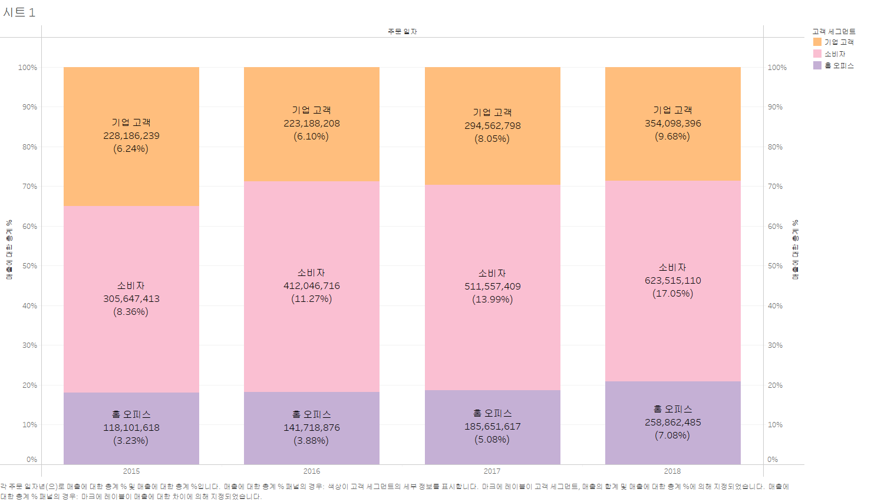
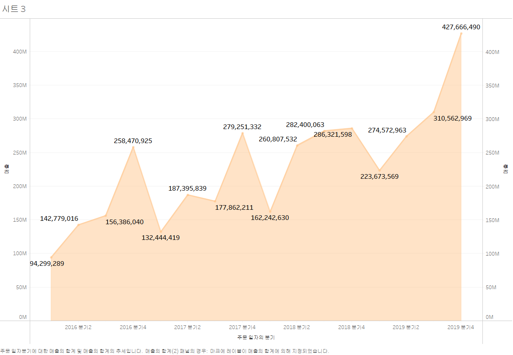
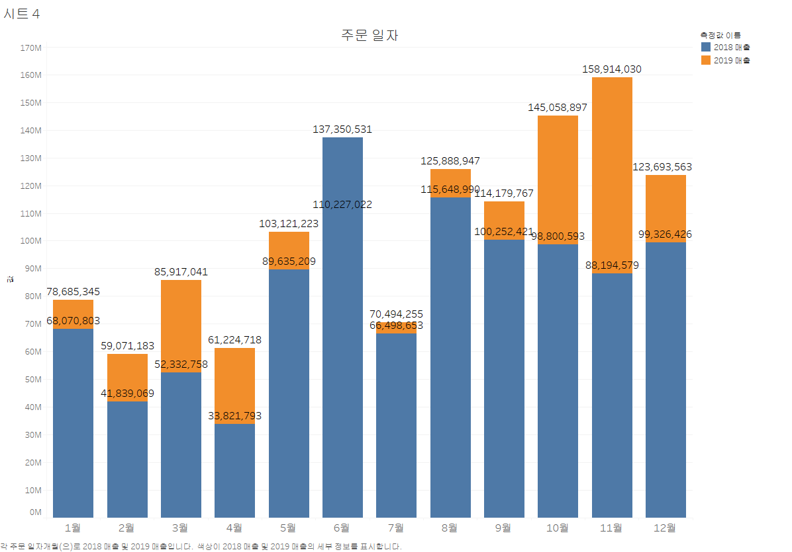
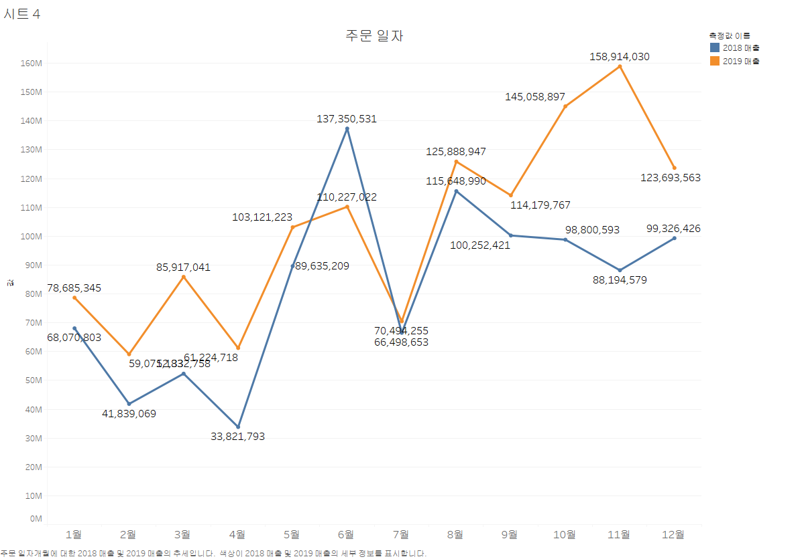
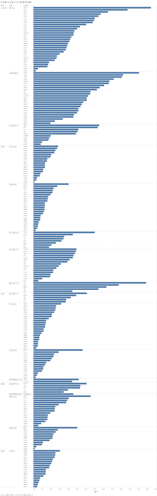
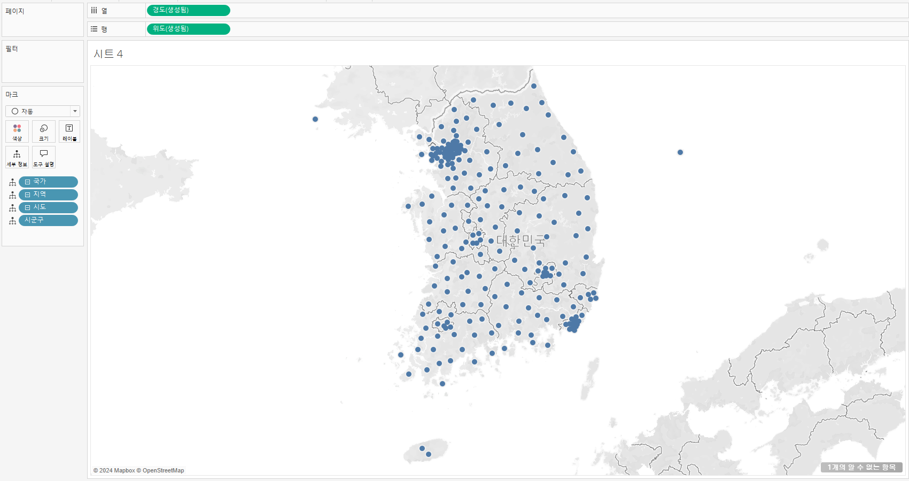

## 1. 고객별 재구매 시기 데이터 분석 시각화
- 히스토그램 그래프
- 
- 설명 : 이 그래프는 고객의 첫 구매 이후 두 번째 구매까지 걸린 일수를 일별로 나눈 분포를 보여줍니다.
X축은 고객이 두 번째 구매를 하기까지 소요된 일수를 나타내며, Y축은 해당 일수에 해당하는 고객의 수를 나타냅니다.
각 막대는 특정 구간에 해당하는 고객 수를 보여주며, 높이가 높을수록 그 구간에 해당하는 고객의 재구매 비율이 높은 것을 의미합니다. 
그래프를 보면, 두 번째 구매까지 걸린 일수가 10일에서 50일 사이에 많은 고객이 집중되어 있으며, 특히 20일, 30일, 40일 구간에서 높은 빈도를 보입니다.
이는 많은 고객들이 첫 구매 후 약 한 달 이내에 두 번째 구매를 하는 경향이 있음을 시사합니다. 반면 100일 이후부터는 두 번째 구매를 하는 고객 수가 급격히 줄어들며, 이후에는 일정한 패턴 없이 낮은 빈도가 이어집니다.
예를 들어, 그래프에서 100일 구간에 해당하는 막대는 고객들이 두 번째 구매까지 걸린 평균 기간이 100일임을 나타내며, 교차 카운트는 25명입니다.

## 2. 고객 세그먼트별 매출액 증감 추이 데이터 분석 시각화
- 원+라인 그래프
- 
- 설명 : 이 그래프는 연도별로 세 가지 고객 세그먼트(기업 고객, 소비자, 홈 오피스)의 매출 추이를 보여줍니다.
X축은 연도를, Y축은 매출 금액을 나타내며, 각 세그먼트는 서로 다른 색상과 원형 마커로 표시되어 있습니다.
그래프에 따르면, 기업 고객 세그먼트(주황색)는 지속적으로 매출이 증가하고 있으며, 특히 2019년에 6억 2천만 이상의 매출을 기록하여 세그먼트 중 가장 높은 매출을 보였습니다.
소비자 세그먼트(파란색)는 비교적 완만하게 증가하는 추세를 보이고 있지만, 2016년부터 2019년까지 꾸준한 성장세를 유지하고 있습니다.
홈 오피스 세그먼트(빨간색)는 다른 두 세그먼트에 비해 매출이 낮지만, 2016년부터 2019년까지 매출이 증가하여 2억 5천만에 이르는 매출을 기록했습니다.
이를 통해 각 고객 세그먼트의 매출 성장 패턴을 파악할 수 있으며, 기업 고객 세그먼트가 가장 큰 성장 잠재력을 가지고 있음을 알 수 있습니다. 이러한 분석 결과는 각 세그먼트별 맞춤형 전략 수립에 중요한 참고자료가 될 수 있습니다.

## 3. 고객 세그먼트별 매출액 데이터 분석 시각화
- 누적 막대 차트 그래프
- 
- 
- 설명 : 이 그래프는 연도별로 고객 세그먼트(소비자, 기업 고객, 홈 오피스) 매출을 보여주는 누적 막대 차트입니다. X축은 연도, Y축은 매출 금액(단위: M)으로, 각 색상은 고객 세그먼트를 나타냅니다.

소비자(주황색) 세그먼트는 매출이 지속적으로 증가하고 있으며, 2019년에 6억 2천만 이상의 매출을 기록하여 가장 큰 매출 성장을 보였습니다.
기업 고객(파란색) 세그먼트는 상대적으로 안정적으로 증가하며, 2016년부터 2019년까지 꾸준히 상승하여 2019년에는 3억 5천만 이상의 매출을 기록했습니다.
홈 오피스(빨간색) 세그먼트는 다른 두 세그먼트에 비해 매출 비중이 낮지만, 2016년부터 2019년까지 점진적인 성장세를 보이며, 2019년에는 2억 5천만 이상의 매출을 기록했습니다.
이 차트를 통해 소비자 세그먼트의 매출이 가장 빠르게 증가하는 추세를 보이고 있으며, 모든 세그먼트에서 매출이 고르게 성장하고 있음을 확인할 수 있습니다.

## 4. 년도별 매출액 데이터 분석 시각화
- 영역 차트 그래프
- 
- 설명 : 이 그래프는 2016년부터 2019년까지의 분기별 매출 추이를 보여주는 영역 차트입니다. X축은 분기별 기간을 나타내며, Y축은 매출 금액(단위: M)입니다.

각 분기의 매출이 표시되어 있으며, 다음과 같은 주요 사항을 확인할 수 있습니다:

2016년 4분기에 큰 폭으로 매출이 증가하여 2억 5천만 이상의 매출을 기록했고, 이후 몇 분기 동안 상승세를 보이다가 2017년 3분기에 소폭 감소하였습니다.
2018년 4분기에는 매출이 2억 8천만 이상으로 다시 상승했고, 이후 일시적인 하락을 겪은 후 2019년 4분기에 4억 2천만 이상의 매출로 최고점을 기록했습니다.
전반적으로 매출이 점진적으로 증가하는 추세를 보이며, 매년 4분기에서 상대적으로 높은 매출을 기록하는 경향이 있습니다.
이 그래프는 각 분기마다의 매출 증감을 시각적으로 쉽게 파악할 수 있게 해주며, 연말의 매출 상승 패턴을 확인할 수 있습니다.

## 5. 월별 매출액 년도 비교 데이터 분석 시각화

<table>
  <tr>
    <td align="center">
      <b>막대 그래프</b> 
      
    </td>
    <td align="center">
      <b>라인 그래프</b> 
      
    </td>
  </tr>
</table>

- 설명 : 이 그래프는 2018년과 2019년 월별 매출을 비교한 막대그래프입니다. 파란색 막대는 2018년 매출, 주황색 막대는 2019년 매출을 나타내며, 각 막대 위에는 해당 연도의 매출액이 표시되어 있습니다.

그래프를 보면, 2019년 매출이 전반적으로 2018년보다 높게 나타나며, 특히 1월, 5월, 9월, 10월에 두드러진 증가가 보입니다. 이와 같은 매출 증가는 두 해 동안의 매출 성장 추세를 시각적으로 파악하는 데 유용합니다.

아래 선 그래프는 같은 데이터를 바탕으로 2018년과 2019년 월별 매출을 선으로 비교한 것입니다. 파란색 선은 2018년 매출, 주황색 선은 2019년 매출을 나타내며, 각 월별로 두 해의 매출 변화를 시각적으로 확인할 수 있습니다.

선 그래프를 보면, 2018년은 월별 매출 변동이 비교적 작고 일정한 패턴을 보이는 반면, 2019년은 매출 변동 폭이 크고, 1월에서 감소한 후 5월과 10월에 큰 폭으로 증가하는 특징이 있습니다. 특히 10월에 2019년 매출이 최고점을 기록하며, 전반적으로 2019년 매출이 2018년보다 높은 경향을 보여줍니다.

두 그래프 모두 2019년의 매출 성장이 두드러진 해였음을 시각적으로 잘 나타냅니다.

## 6. 년도별 매출액 데이터 분석 시각화
- 영역 차트 그래프
- 
- 설명 : 이 그래프는 2016년부터 2019년까지의 분기별 매출 추이를 보여주는 영역 차트입니다. X축은 분기별 기간을 나타내며, Y축은 매출 금액(단위: M)입니다.

## 7. 년도별 매출액 데이터 분석 시각화
- 영역 차트 그래프
- 
- 설명 : 이 그래프는 2016년부터 2019년까지의 분기별 매출 추이를 보여주는 영역 차트입니다. X축은 분기별 기간을 나타내며, Y축은 매출 금액(단위: M)입니다.

## 8. 지역별 시도별 시군구별 매출액 데이터 분석 시각화
- 계층 그래프
- 
- 설명 : 이 그래프는 제품 대분류와 중분류별로 제품명에 따른 총 매출을 막대그래프로 나타낸 것입니다. 각 막대는 특정 제품의 매출액을 나타내며, 높은 매출 순으로 정렬되어 있습니다.

그래프를 보면, Motorola, Nokia, Apple, Samsung, Cisco 등의 스마트폰과 오디오 제품이 높은 매출을 기록하고 있으며, 상위 제품들은 주로 "Full Size" 또는 "with Contract" 등 특정 옵션이 포함된 모델임을 확인할 수 있습니다. 
특히 Motorola와 Nokia의 일부 제품이 상위권에 위치해 높은 매출을 기록하고 있으며, Apple과 Samsung의 스마트폰 모델도 꾸준한 매출을 보입니다.

이 그래프는 각 제품의 매출 기여도를 시각적으로 비교할 수 있게 하며, 매출이 높은 인기 제품들을 파악하는 데 유용합니다.

## 9. 제품 대분류별 중분류별 제품명별 매출액 데이터 분석 시각화
- 계층 그래프
- 
- 설명 : 

## 10. 국가별 지역별 시도별 시군구별 지도 데이터 분석 시각화
- 지리적 역할 그래프 
- 
- 설명 : 

